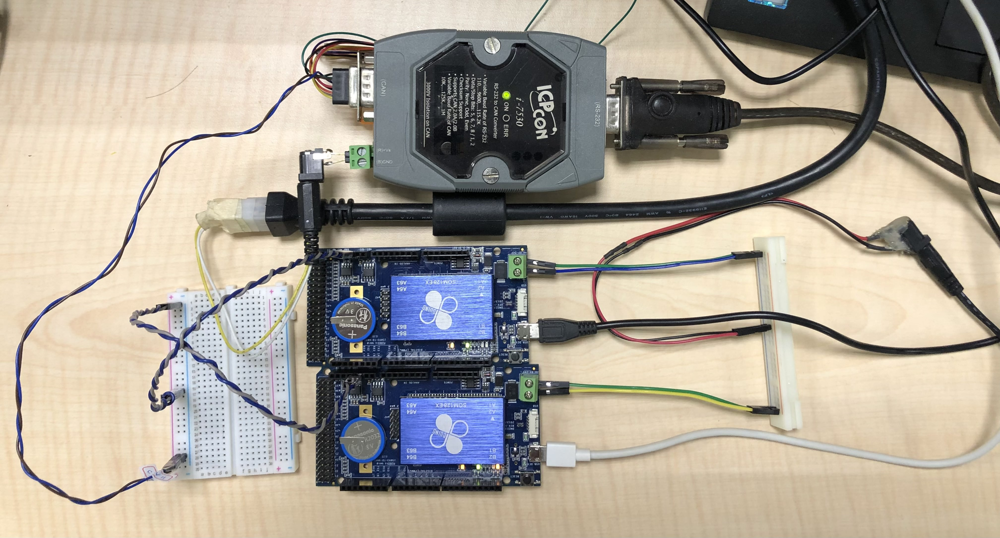

# CanFestival86

## Overview
[CanFestival86](https://www.86duino.com/?p=21060&lang=TW) is a [CanFestival](https://canfestival.org/) porting aiming to run on [86Duino One](https://www.86duino.com/?p=70) board which is based on x86 architecture. The CanFestival version ported is CanFestival-3-de1fc3261f21.
CanFestival is a popular CANopen stack and 86Duino One board comes with native CAN bus interface. With CanFestival86, it's literally easy to play with CANopen protocol and you can also build your own CANpoen device as well.

[86Duino](https://www.86duino.com/) is an Arduino-like simple but extremely powerful embedded developing platform. With x86 based CPU, which has ability to run an OS like DOS/Linux/Windows, abundant I/O interface and plenty of popular libraries supported makes things easier and possible. Code editing, compiling and uploading to 86Duino board can be done through Arduino compatible 86Duino IDE.

The sections below help you to try out the [examples](#running-the-canfestival86-example) and [make your own](#build-your-node) CanFestival-based CANopen node.

## CanFestival
CanFestival is a popular open-source CANopen Stack authored by [ETisserant](https://github.com/etisserant), it can run on multiple platforms such as PC with Linux/Windows OS and many of embedded devices.

CanFestival also provides a tool to create a CANopen object dictionary for CanFestival project. For more info please visit it's [official site](https://canfestival.org/doc) and refer to the user [manual](https://hg.beremiz.org/canfestival/raw-file/tip/objdictgen/doc/manual_en.pdf).

### Basic CANopen Features
CanFestival is designed compliant to DS-301.
- NMT
- SYNC
- EMCY
- PDO
- SDO
- HEARTBEAT/NODE-GUARD
- ...

### And more
CanFestival also implments some useful functions beyond DS-301.
- concise DCF 
- LSS

## CanFestival86 Implementation
CanFestival is a CANopen stack which is a piece of upper-level code written in C. It's independent to the lower-level implementation of drivers so it's portable to any hardware architecture by implementing the hardware specific drivers.
CanFestival86 keeps the most of the source code of CanFestival, only implementing needed lower-level drivers such as can driver and timer driver to fit 86Duino hardware and system.

CanFestival is a fantastic project that support the CANopen features fairly completely, however there may still some parts need to be improved. To keep the most the same as source code, CanFestival86 doesn't suppose to fix it here. Instead, some of them should be aware of will be discussed in the [review](#review) section.

CanFestival86 provides a simple interface to the CanFestival functionalities which is just a wrap of CanFestival API.
It tries to keep things simple by hiding the unnecessary control options from user. Nevertheless, user can still use the CanFestival API directly without any restricts if one want to try more possibilities.

## Running the CanFestival86 Example 
The following demo is running on 86Duino One board, this example turn a 86Duino One board to CANopen Master and another 86Duino One board to CANopen Slave device. You may still run one of either Master or Slave on one board to see what's going on if you only have a 86Duino One beside.

What we need are listed below:
- (at least one of) two pieces of 86Duino One boards. 
- (optional) PC CAN Interface, used to observer the CAN/CANopen Messages.
- (optional) terminal resistors, used at both end of the CAN bus. 
  86Duino One has built in a 120 ohm terminal resistor inside, normally no need to use external terminal resistors between two 86Duino One except there are other CAN devices that need to use it.
- (must) few jumper wires.

### Wiring
Wiring is simple, connect CAN-H of all devices together and wire CAN-L of all devices together. Optionally add on a terminal resistor across CAH-H and CAN-L at both end of the CAN bus if needed.

Connections:  
  - CAN-H <-> CAN-H
  - CAN-L <-> CAN-L
  


Hook up the USB of both 86Duino One to PC for accessing serial monitor, and use the external power supply for 86Duino One if your PC's USB power is either not stable or not enough for working.

### Installing the CanFestival86 Library
- download the library which comes in a zip file [here](https://github.com/acen2009/CanFestival86).
- open up the 86Duino IDE, [download here](https://www.86duino.com/?page_id=8918).
- go to sketch -> include library -> add .zip file library -> choose the zip file download just now.

### Uploading the example code
Steps
- Open up the 86Duino IDE
  - go to tool -> select board -> select 86Duino One
  - go to tool -> select com port -> select the port for one of the 86Duino One
  - File -> Example -> CanFestival86 Library -> master_node
  - upload the code
- Open up another independent 86Duino IDE entity for CANopen Slave Example, by doing so, we can open up both serial monitor for both 86Duino at the same time.
  - go to tool -> select board -> select 86Duino One
  - go to tool -> select com port -> select the port for another 86Duino One
  - File -> Example -> CanFestival86 Library -> slave_node
  - upload the code

### Testing
This example put `while(!Serial)` in the setup() function in order to wait for serial monitor to open, so you won't miss any message at the beginning. Now, open serial monitor to start! 

Please, follow the steps below:
- open the serial monitor of slave node, you'll see Hello CanFestival!, Slave Node Begin! and nothing else, because it's stay in the "Pre-Operational mode" and waitting for the master to start.
- open the serial monitor of master node, the master node first switch itself to Pre-Operational mode, and in the mean time reset all the nodes on the CAN bus, thus the slave node will be reset and boot up again. After the master node receivces the "bootup message" send out from slave node, master node config the heartbeat parameter through the SDO channel, this is implemented in the callback function slaveBootupCallback().
- after that, you may send character 'i'/'p'/'o'/'s' to serial monitor of master node to switch the CANopen state machine of master node. Let's try to send 'o' to switch master node to "Operational mode", by doing so you'll find out the slave node is also switched to "Operational mode" by the master at the same time. The PDO communication is now activated and start exchanging messages.
  - send character 'i' to switch to "Initialization mode"
  - send character 'p' to switch to "Pre-Operational mode"
  - send character 'o' to switch to "Operational mode"
  - send character 's' to switch to "Stopped mode"

Cheers, both CANopen master node and CANopen slave node is working now. Play with it and see what's happening.

### Output
Serial Monitor Output from slave node
```
Hello CanFestival!
Slave Node Begin!
lifegrd.c,124 : 0X3110 Received NMT nodeId :  0X1 
lifegrd.c,146 : 0X3100 The NMT is a bootup from node :  0X1 
nmtSlave.c,50 : 0X3400 NMT received. for node :   0X0 
states.c,147 : 0X9999 resetSDO(d) 0X270f 
...
sdo.c,769 : 0X3a60 proceedSDO  0X0 
sdo.c,785 : 0X3a62 proceedSDO. I am server. index :  0X1200 
sdo.c,833 : 0X3a69 I am SERVER number  0X0 
sdo.c,971 : 0X3a79 Received SDO Initiate Download (to store data) defined at index 0x1200 +  0X0 
sdo.c,972 : 0X3a80 Writing at index :  0X1017 
sdo.c,973 : 0X3a80 Writing at subIndex :  0X0 
...
sync.c,171 : 0X3002 SYNC received. Proceed.  0X0 
pdo.c,588 : 0X3962 Reading PDO at index :  0X1800 
pdo.c,599 : 0X3964   PDO is on SYNCHRO. Trans type :  0X3 
pdo.c,60 : 0X3009   PDO CobId is :  0X182 
pdo.c,61 : 0X300d   Number of objects mapped :  0X1 
pdo.c,80 : 0X300f   got mapping parameter :  0X20000020 
pdo.c,81 : 0X3050     at index :  0X1a00 
pdo.c,82 : 0X3051     sub-index :  0X1 
pdo.c,104 : 0X3015   End scan mapped variable 0X0 
pdo.c,438 : 0X396d sendPDO cobId : 0X182 
pdo.c,439 : 0X396e      Nb octets  :  0X4 
...
```

Serial Monitor Output from master node
```
Hello CanFestival!
Master Node Begin!
slave boot up!
lifegrd.c,124 : 0X3110 Received NMT nodeId :  0X2 
lifegrd.c,146 : 0X3100 The NMT is a bootup from node :  0X2 
sdo.c,1877 : 0X3ac0 Send SDO to write in the dictionary of node :  0X2 
sdo.c,1878 : 0X3ac1                                    At index :  0X1017 
sdo.c,1879 : 0X3ac2                                    subIndex :  0X0 
sdo.c,1880 : 0X3ac3                                    nb bytes :  0X2 
...
SDO Succeeded
timer.c,110 : 0X3320 DelAlarm. handle =  0X3 
...
sync.c,132 : 0X3001 sendSYNC  0X0 
sync.c,171 : 0X3002 SYNC received. Proceed.  0X0 
lifegrd.c,191 : 0X3130 Producing heartbeat:  0X7f 
lifegrd.c,124 : 0X3110 Received NMT nodeId :  0X2 
...
get counter from slave through PDO channel:899912810
pdo.c,185 : 0X3935 proceedPDO, cobID :  0X182 
pdo.c,205 : 0X3936 cobId found at index  0X1400 
pdo.c,258 : 0X3942 Variable updated by PDO cobid :  0X182 
pdo.c,259 : 0X3943          Mapped at index :  0X2000 
pdo.c,260 : 0X3944                 subindex :  0X0 
...
```

### Sum up
After openning up the serial monitors, you'll see the output messages from CanFestival kernel. You could call the function setVerbose(); to enable/disable the CanFestival kernel message output.

It's recommended to hook up any CAN Bus Interface for PC to see the raw data from CAN bus, that is helpful to know how it works actually under the hood.

This example go through some basic CANopen communication functionalities including NMT / SYNC / SDO / PDO / HEARTBEAT.

## Build your node
This section will show you how to make the CANopen Object Dictionary for a CanFestival node. CanFestival project provide a GUI tool written in Python called "objdictedit.py". After download the CanFestival project, you can find it in the directory "CanFestival-3-de1fc3261f21\objdictgen".

Run the program by executing the command `python objdictedit.py` in the terminal.

Following the step by step instructions below to build the master and slave node respectively used by [example](#running-the-canfestival86-example) above.

### Master node
- executing the objdictedit.py by `python objdictedit.py`
- file -> new 
  - type: master
  - Network Management: Heartbeat
  - Name: MyMaster
  - check Generate SYNC then press ok
- setup the sync signal parameter, go to Communication Parameters 
  - click on 0x1005 SYNC COB ID, set the value of subindex 0x00 to 0x40000080. This will activate the SYNC signal on COBID channel 0x80.
  - click on 0x1006 Communication / Cycle Period, set the value of subindex 0x00 to 1000000, that means trigger a SYNC signal every second.
- setup the hearbeat parameter, go to Communication Parameters click on 0x1017 Producer Hearbeat Time, set the value of subindex 0x00 to 1000, that means produce a heartbeat per single second.
- setup the PDO Communication
  - add a app varialbe, go to Manufacturer Specific, click add, inside the dialog box, set Index to 0x2000, set name to counter_from_slave, set type to VAR then click ok. Set the type of subindex 0x00 to UNSIGNED32.
  - go to Receive PDO Parameters, click add, then OD 0x1400 Receive PDO 1 Parameter shows up, set the value of subindex 0x01 to 0x182.
  - go to Receive PDO Mapping, click on 0x1600 Receive PDO 1 Mapping, right click on subindex 0x00, click add subindexes, then enter 1, the subindex 0x01 will shows up, set the value of subindex 0x01 to counter_from_slave (0x2000).
- setup the SDO Communication, go to SDO Parameters, click on the drop-down menu next to the add button, choose SDO Client, then click add, the 0x1280 Client SDO 1 Parameter shows up, then 
  - set the value of subindex 0x01 to 0x602.
  - set the value of subindex 0x02 to 0x582.
  - set the value of subindex 0x03 to 2.
- save the project file, go to file -> save as -> MyMaster.od.
- build the object dictionary files for CanFestival node, go to file -> Build Dictionary -> MyMaster.c. It will create the MyMaster.c and MyMaster.h which are necessary for the master node.

### Slave node
- executing the objdictedit.py by `python objdictedit.py`
- file -> new 
  - type: slave
  - Network Management: Heartbeat
  - Name: MySlave
  - press ok
- setup the PDO Communication
  - add a app varialbe, go to Manufacturer Specific, click add, inside the dialog box, set Index to 0x2000, set name to app_counter, set type to VAR then click ok. Set the type of subindex 0x00 to UNSIGNED32.
  - go to Transmit PDO Parameters, click on 0x1800 Transmit PDO 1 Parameter, set the value of subindex 0x02 Transmission Type to 0x3. This means it will send a PDO after receiving 3 SYNC signals.
  - go to Transmit PDO Mapping, click on 0x1A00 Transmit PDO 1 Mapping, right click on subindex 0x00, click delete subindexes, then enter 7 to delete unnecessary entries, then set the value of subindex 0x01 to app_counter(0x2000).
- save the project file, go to file -> save as -> MySlave.od.
- build the object dictionary files for CanFestival node, go to file -> Build Dictionary -> MySlave.c. It will create the MySlave.c and MySlave.h which are necessary for the slave node.

Put the generated files in the same folder of your application project, with the Object Dictionary files, you are ready to go!

## Review
### About OD Editor GUI program objdictedit.py
It's GUI program for CanFestival which can import / export .EDS file, build a dictionary of a node and eventually create .c and .h files for application. It works and it's ok to use for the basics, but I would say that functionality is not complete and some of them are defective.
- When use a variable with a type `unicode_string` always gives a build-time error. Maybe not support yet !?
- We may add OD 1F22 Concise DCF in GUI, however can not find a way to modify the value in the pop out menu.
- Can not define customized special user type.

### Becareful of using some of the CANopen Data type
In CANopen, there are multiple definitions of integer, for example, UNSIGNED8/UNSIGNED16/UNSIGNED24/UNSIGNED32 ...
However, there is not a basic type which directly fit UNSIGNED24 while programming in C, the implementation in CanFestival for that is simply treat it as a UNSIGNED32. In a result, the UNSIGNED24 is not truely unsingned 24-bit in CanFestival design.</br>
So let's say if you wanna send a variable with data type UNSIGNED24 through SDO, you should put 4 in the argument for count of bytes, instead of 3.CanFestival's implementation made it handy to use but do not care about the waste of the memory and waste in transmission.

Moreover, code in objaccess.c, the last few lines of _setODentry() function:</br>
  `*pExpectedSize = szData;` should not be put before `accessDictionaryError(wIndex, bSubindex, szData, *pExpectedSize, OD_LENGTH_DATA_INVALID)`</br>
otherwise the argument *pExpectedSize and szData will be the same while passing into the function, and the error message will be problematic.

### About design of the PDO Transmission 
The PDO Transmission type of 0xFE & 0xFF which define a PDO transmission is Event- / timer-driven.
However, In CanFestival implementation of that is sending a PDO immediately every time a RTR request signal is received.</br>
According to [CiA PDO Protocol](https://www.can-cia.org/can-knowledge/canopen/pdo-protocol), a CANopen stack should not fix the Event-driven transmission type PDOs to be coupled with RTR signal, instead, should leave the definition of what is a event and let user app or application profile to determine it.

### About callback
In CanFestival86, timer driver and CAN driver are all implements by interrupt. CanFestival leaves lots of callback for user app to customize their implementation behavior. One should note that, do not put the code which may come with non-reentrant problem in the callback.
